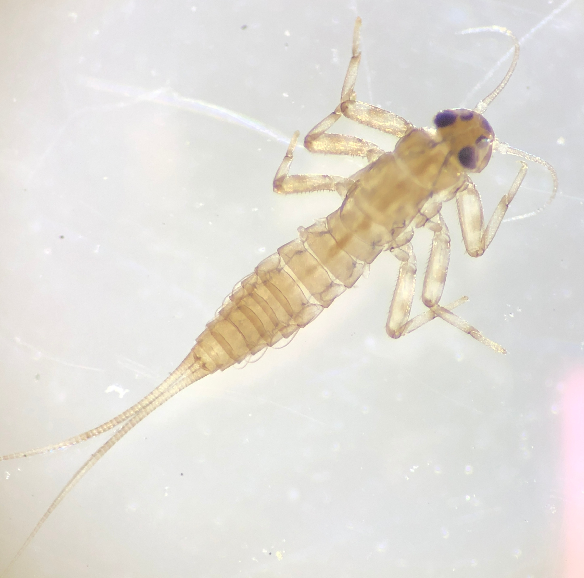
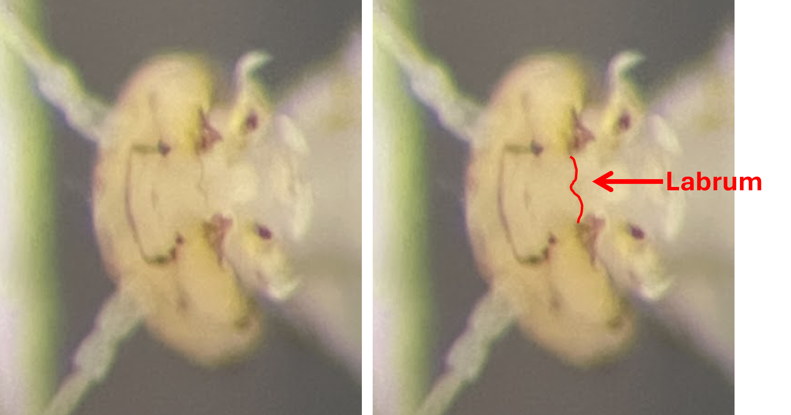

## Using a Dichotomous Key {.smaller}

- Identifying organisms using a technical key can be tricky.

- This is a simplified demonstration of how to use a dichotomous key to practice identifying a macroinvertebrate to prepare for doing this same activity with real organisms during lab.

- Use the arrow keys on your keyboard to move back and forth through these slides and click on images to make them larger.

## Mystery Macroinvertebrate {.smaller}

:::: {.columns}

::: {.column width="30%"}
{.lightbox fig-alt="Photo of an aquatic larva viewed from the dorsal side." fig-align="left" width="300"}
:::
::::

This is an image of a macroinvertebrate collected from the Mill River in Northampton, MA. We want to identify it down to the family level.

## Dichotomous Key Step 1 {.smaller .quiz-question}

A dichotomous key gives pairs of options to help you ID the organism. Select the option that describes the organism (click on photos to zoom in)

:::::: columns
::: {.column width="50%"}
{fig-alt="dorsal view of an aquatic larva." fig-align="center" width="150"}
:::

::: {.column width="50%"}
{fig-alt="dorsal view of macroinverterate with three main body parts labeled head, thorax, abdomen. 6 legs are present and 2 long tails." fig-align="center" width="150"}
:::

::::::

-   [1 organism without distinct head, thorax, and abdomen .... **2**]{data-explanation="this organism does have a distinct head, thorax, and abdomen"}
-   [1' organism with distinct head, thorax, and abdomen .... **3**]{.correct}

## {.smaller .quiz-question}

:::::: columns
::: {.column width="50%"}
{fig-alt="dorsal view of an aquatic larva." fig-align="center" width="200"}
:::

::: {.column width="50%"}
{fig-alt="dorsal view of macroinverterate with three main body parts labeled head, thorax, abdomen. 6 legs are present and 2 long tails." fig-align="center" width="200"}
:::

::::::

-   [3 organism without three pairs of jointed legs attached to the thorax .... **4**]{data-explanation="this organism does have 3 pairs of jointed legs"}
-   [3' organism with three pairs of jointed legs attached to the thorax .... **Class: Insecta** .... **5**]{.correct}

## {.smaller .quiz-question}

:::::: columns
::: {.column width="50%"}
{fig-alt="dorsal view of an aquatic larva." fig-align="center" width="200"}
:::

::: {.column width="50%"}
{fig-alt="dorsal view of macroinverterate with three main body parts labeled head, thorax, abdomen. 6 legs are present and 2 long tails." fig-align="center" width="200"}
:::

::::::

-   [5 Three long tails (but sometimes two) and gills on the abdomen .... **Order: Ephemeroptera (mayflies)** .... **6**]{.correct}
-   [5' Two long tails and no gills on the abdomen .... **Order: Plecoptera (stoneflies)** ....  **7**]{data-explanation="this organism has two tails but it DOES have abodominal gills"}

## {.smaller .quiz-question}

:::::: columns
::: {.column width="50%"}
{fig-alt="close up of head showing notched labrum." fig-align="center" width="300"}
:::

::::::

-   [6  Labrum notched ....  **8**]{.correct}
-   [6' Labrum smooth and straight (not notched) .... **9**]{data-explanation="the labrum has a distinct notch, it is not smooth and straight"}

## {.smaller .quiz-question}

:::::: columns
::: {.column width="50%"}
{fig-alt="dorsal view of an aquatic larva." fig-align="center" width="200"}
:::
::::::

-   [8 antennae relatively long (two to three times longer than the width of the head) .... **Family: Baetidae**]{.correct}
-   [8' antennae relatively short (less than two times longer than the width of the head .... **9**]{data-explanation="these antennae are relatively long"}

##

:::: {.columns}

::: {.column width="30%"}
{.lightbox fig-alt="Photo of an aquatic larva viewed from the dorsal side." fig-align="left" width="300"}
:::
::::

You got it! This macroinvertebrate is in the family Baetidae, also called the small minnow mayfly. 
